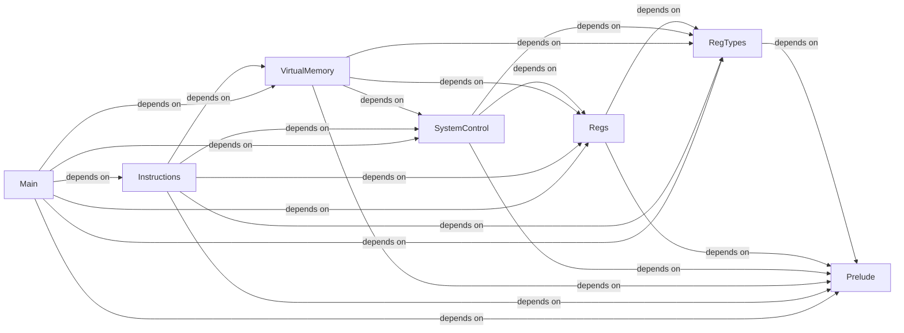

# Module Structure for RISCV ISA Sail Model
This repository provides a modular dependency structure for the [Sail model](https://github.com/riscv/sail-riscv) specifying the RISC-V ISA.

## Why?
While compiling `sail` files, the order matters. If `file2.sail` depends on definitions from `file1.sail`, compiling them in the wrong order will result in an error: <br />

```
sail file2.sail file1.sail
Type error: Unknown type level operator or function
```

To avoid this, dependencies must be compiled first:<br />

```sail file1.sail file2.sail```

In large projects like Sail-RISCV, determining a correct order manually is challenging. The module structure in this repository ensures each `sail` file is compiled only after its dependencies, maintaining a valid compilation sequence. 

## Sail Project
This `.sail_project` file organises `sail` files into modules, ensuring proper dependency resolution based on the [Reading Guide](https://github.com/riscv/sail-riscv/blob/master/doc/ReadingGuide.md), [Modular Sail Specifications Guide](https://github.com/rems-project/sail/blob/sail2/doc/asciidoc/modules.adoc), and [CMakeLists.txt](https://github.com/riscv/sail-riscv/blob/master/model/CMakeLists.txt).

Each module consists of a sequence of `sail` files treated as a logical unit. If a module requires definitions from another module, it declares a dependency using the `requires` statement. 

### Exluded Files
The following `sail` files are excluded:

#### Register Bitwidth: 32 vs 64
- **riscv_xlen64.sail** (64-bit register width)
  - **Reason:** The 32-bit width, `riscv_xlen32.sail`, is included instead
#### Floating-point: Single- vs Double- Precision
- **riscv_flen_D.sail** (double-precision floating-point extension)  
  - **Reason:** It defines `type flen_bytes`, which clashes with `riscv_flen_F.sail` (single-precision floating-point extension)
- **riscv_insts_dext.sail** (double-precision floating-point extension)
  - **Reason:** Other double-precision definitions in the above file are excluded

#### RISC-V Formal Interface (RVFI)
- **riscv_step_rvfi.sail**  
  - **Reason:** It defines `function ext_fetch_hook`, which clashes with `riscv_step.sail`

- **riscv_fetch_rvfi.sail**  
  - **Reason:** It defines `function fetch`, which clashes with `riscv_fetch.sail` 

- **rvfi_dii.sail**
  - **Reason:** Other RVFI  files above were excluded

#### Memory Model: Sequential vs Concurrent
- **riscv_jalr_rmem.sail** (memory model for non-sequential execution)
  - **Reason:** The sequential model, `riscv_jalr_seq.sail`, is included instead

- **riscv_insts_rmem.sail**
  - **Reason:** Other related file above is excluded

#### Coq Related
- **riscv_termination.sail**
  - **Reason:** It is only required for Coq compilation target

## Module Dependencies
- **Prelude** (Core types and definitions)
- **RegTypes** (Core register types)
  - Requires: Prelude
- **Regs** (General-purpose and system registers)
  - Requires: Prelude, RegTypes
- **SystemControl** (Privilege transitions and exceptions)
  - Requires: Prelude, RegTypes, Regs
- **VirtualMemory** (Page tables and virtual memory translation)
  - Requires: Prelude, RegTypes, Regs, SystemControl
- **Instructions** (Instruction set definitions and memory model)
  - Requires: Prelude, RegTypes, Regs, SystemControl, VirtualMemory
- **Main** (Core execution logic)
  - Requires: Prelude, RegTypes, Regs, SystemControl, VirtualMemory, Instructions

### Module Dependency Graph 


 
## Usage
1. Install [Sail](https://github.com/rems-project/sail)
2. Download `sail-riscv-master` from [RISCV Sail Model repository](https://github.com/riscv/sail-riscv/tree/master) and build the RISC-V model.
3. Download the `.sail_project` file in this repository. Move it to the `sail-riscv-master/model` folder.
4. On the Command Line Interface, navigate to the `sail-riscv-master/model` folder and invoke `sail` as follows using your desired options: `sail <options> riscv.sail_project`
     For example, for type checking: `sail riscv.sail_project`
                  for C compilation: `sail -c riscv.sail_project`


